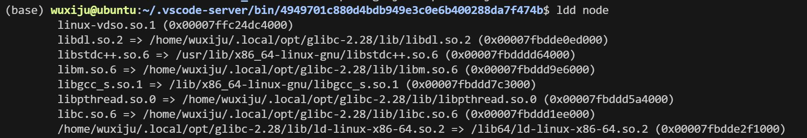
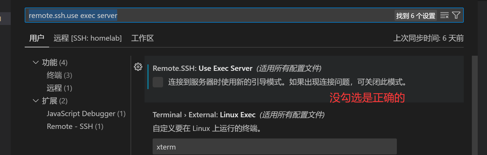

# 脚本工具集

本仓库包含了一系列用于环境配置的脚本，可帮助您快速设置开发环境。

## setup_anaconda.sh

### 功能介绍
这个脚本用于在Linux环境中自动安装Anaconda3，特别适用于怀柔节点服务器。脚本会：
- 自动下载最新版本的Anaconda（Linux 64位）
- 在/data1/username目录下安装Anaconda3
- 配置必要的环境变量
- 初始化conda环境
- 提供选项处理SSL证书验证问题

### 使用方法
登录到怀柔节点，然后直接执行仓库根目录下的setup_anaconda.sh
```bash
wget -O - https://raw.githubusercontent.com//ziwenhahaha/scripts/blob/master/setup_anaconda.sh | bash
```

## setup_ollama.sh

### 功能介绍
这个脚本用于设置和配置Ollama（大型语言模型运行环境）。脚本会：
- 下载Ollama的Linux x64版本
- 解压并安装到/data1/username/ollama目录
- 配置必要的环境变量（OLLAMA_HOST, OLLAMA_MODELS等）
- 使用tmux创建一个后台会话并启动Ollama服务器
- 设置Ollama运行环境，使其准备好运行模型（如qwen:0.5b）

### 使用方法
直接执行仓库根目录下的setup_ollama.sh
```bash
wget -O - https://raw.githubusercontent.com//ziwenhahaha/scripts/blob/master/setup_ollama.sh | bash
```

## setup_vscode_patch.sh

### 功能介绍
这个脚本解决了在某些旧Linux系统上运行VS Code远程开发时的glibc版本兼容性问题。脚本会：
- 创建必要的跳过服务器要求检查的文件
- 安装bison（通过conda）
- 下载和编译glibc 2.28
- 创建一个自动修补VS Code服务器二进制文件的脚本，让它使用自定义的glibc库
- 设置SSH会话，在每次连接时自动应用补丁
- 避免VS Code远程连接时因glibc版本不匹配而出现的错误

### 使用方法
1、先使用setup_anaconda.sh脚本去安装一个anaconda，跟着提示去运行，它会自动地在/data1/username目录下安装一个anaconda。如果已经安装anaconda了的话，跳过这一步骤。
```bash 
看本文档的setup_anaconda.sh
```

2、执行setup_vscode_patch.sh脚本
```bash 
wget -O - https://raw.githubusercontent.com//ziwenhahaha/scripts/blob/master/setup_vscode_patch.sh | bash
```
安装完毕后，打补丁脚本不会自动触发，需要通过连接ssh的时候来触发这个打补丁。所以第四步需要重启vscode两次。

检测打补丁成功，可以使用：`ldd ~/.code-server/bin/${commit-id}/node`  指令来查看，commit-id需要自己去查看，不能直接复制粘贴本命令。

若如下方显示，则为打补丁成功，（因为现在尚未触发，所以会提示2.27版本不匹配的问题）：


3、客户端需要设置一个东西：在设置里面把remote.ssh.use exec server 的勾去掉：


4、重启vscode两次，第一次是为了打补丁，第二次是正常进入

### 注意事项
- setup_vscode_patch.sh依赖于先安装anaconda
